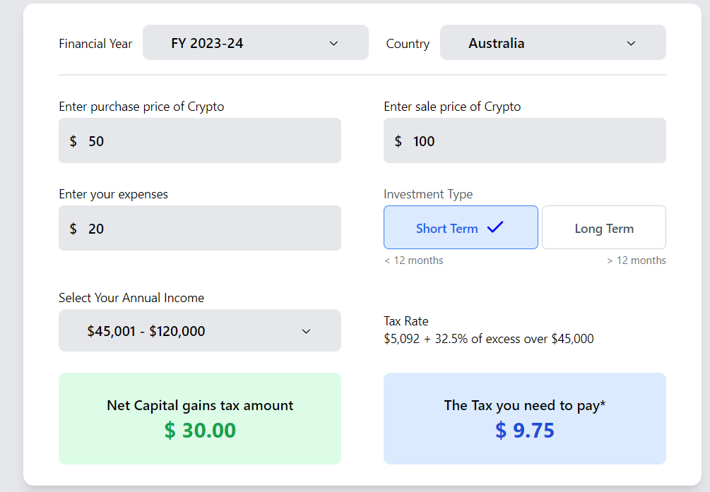
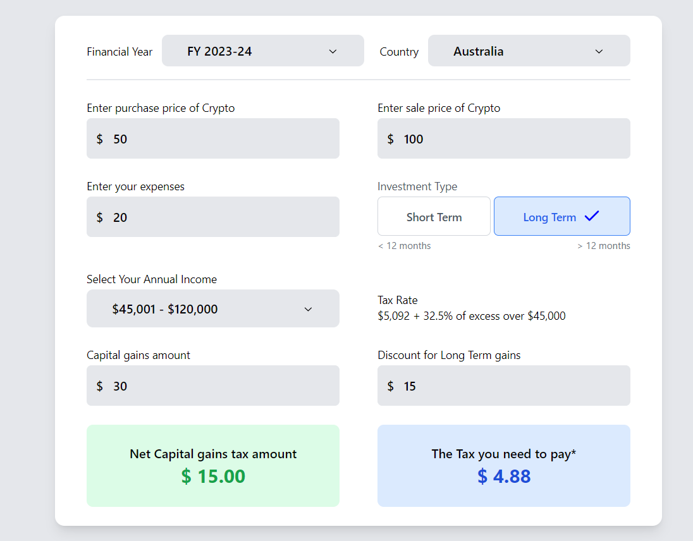

# Crypto Capital Gains Tax Calculator

## Project Overview

This Crypto Capital Gains Tax Calculator is a React-based web application designed to help Australian cryptocurrency investors calculate their capital gains tax liability. The project provides an intuitive interface for computing tax based on investment details, holding period, and annual income.

## Project Screenshots

### Short Term Investment Type View


### Long Term Investment Type View


## Key Functionalities

1. **Capital Gains Calculation**    
   - Compute capital gains from purchase and sale prices
   - Account for additional expenses
   - Support for long-term and short-term investments


2.**Tax Rate Determination**
   - Automatic tax rate calculation based on annual income
   - Applies Australian tax brackets
   - Provides 50% discount for long-term investments


3. **Responsive Design**
   - User-friendly interface
   - Tailwind CSS for responsive layout
   - Detailed tax breakdown


## Technical Implementation Details

### State Management
- Utilized React `useState` and `useEffect` hooks
- Managed multiple state variables:
    - `purchasePrice`: Crypto purchase price
    - `salePrice`: Crypto sale price
    - `expenses`: Transaction expenses
    - `investmentType`: Long-term or short-term
    - `annualIncome`: User's annual income bracket


### Calculation Logic
- Dynamic capital gains computation
- Progressive tax rate application
- Long-term investment discount calculation

### Packages and Libraries Used
- **React**: Core framework
- **Tailwind CSS**: Styling and responsive design
- **Vite**: Build tool and development server

## Unique Coding Approaches

### Tax Rate Determination
```javascript
const getTaxRate = (income) => {
  switch (true) {
    case income == 0:
      return taxRates[0];
    case income <= 18200:
      return taxRates[1];
    case income <= 45000:
      return taxRates[2];
    // Additional tax bracket logic
  }
};
```

### Capital Gains Calculation
- Automatic discount for long-term investments
- Precise tax liability computation

## Learning Outcomes

1. Advanced React state management
2. Complex financial calculation implementation
3. Responsive design techniques
4. Tax calculation logic implementation

## Challenges Overcome

- Implementing accurate tax calculation logic
- Managing complex state interactions
- Creating user-friendly financial interface

## Future Improvements

1. **Enhanced Features**
- More detailed tax reporting

2. **Improved User Experience**

3. **Advanced error handling**
- More detailed tax breakdown
- Printable/saveable reports

4. **Performance Optimization**
- Memoization of calculations
- Improved state management


## Technical Requirements

- React 18+
- Node.js 16+
- npm 8+

## Installation
```bash 
# Clone the repository
git clone https://your-repo-url.git

# Navigate to project directory
cd crypto-tax-calculator

# Install dependencies
npm install

# Start development server
npm run dev
```

## Deployment

Recommended platforms:
- Vercel
- Netlify
- GitHub Pages

## Disclaimer
- This calculator provides estimates only. Always consult a tax professional for precise calculations.

## Contact & Collaboration
Aditya Mishra
adityadevansh2002@gmail.com