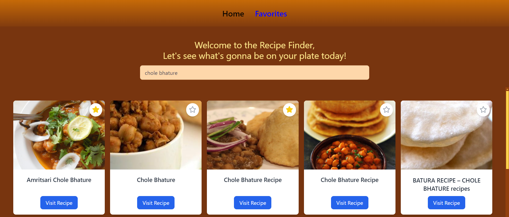
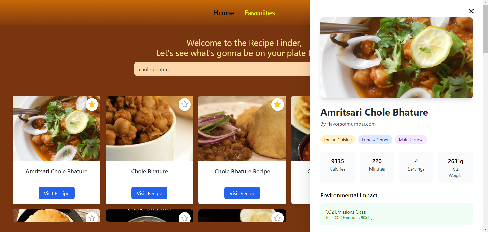

# Weather Dashboard React Application

## Project Overview

This Recipe Viewer is a user-friendly React-based web application designed to fetch and display detailed recipe information. It leverages API integration and modern React practices to provide an intuitive interface for exploring culinary options.

## Project Screenshots  

### Recipe List View


### Detailed Recipe View


### Favorite Section View


## Key Functionalities

1. **Dynamic Recipe Retrieval**
   - Fetches real-time recipe data using the Edamam API
   - Allows users to search recipes based on keywords

2. **Interactive Recipe Details**
   - Displays comprehensive details like ingredients, nutritional information, and health label
   - Highlights environmental impact metrics like CO2 emissions

3. **Responsive Design**
   - Optimized for desktop and mobile devices
   - Smooth animations for opening and closing recipe detail views

## Technical Implementation Details

### State Management
- Utilized React useState and useEffect hooks for efficient state handling
- Managed multiple states, including:
  - `selectedRecipe`: Tracks the currently selected recipe
  - `recipes`: Stores the fetched recipe list
  - `searchCity`: Manages search input
  - `query`: Manages the user's search input

### API Integration
- Axios used for API communication
- External recipe API endpoint from Edamam:
`https://api.edamam.com/api/recipes/v2?type=public&q=${query}&app_id=${AppId}&app_key=${ApiKey}`
- Dynamically fetches and displays recipe data

### Packages and Libraries Used
- **React**: Core framework for UI development
- **Axios**: Simplifies API requests
- **Tailwind CSS**: Provides a clean and responsive design
- **FontAwesome**: Icon implementation
- **@fortawesome/react-fontawesome**: Icon component integration
- **React Icons**: Enhances UI with accessible icons

## Unique Coding Approaches

### Recipe Details Panel Animation
```JSX
return (
  <div
    className={`fixed top-0 right-0 h-full w-[40rem] bg-white shadow-2xl transform transition-all duration-300 ease-in-out overflow-y-auto ${
      selectedRecipe ? "translate-x-0" : "translate-x-full"
    }`}
  >
    {/* Content */}
  </div>
);
```
- Used conditional classes for smooth slide-in and slide-out animations


### Dynamic Rendering of Recipe Tags
```JSX
{selectedRecipe.cuisineType?.map((cuisine) => (
  <span
    key={cuisine}
    className="px-3 py-1 bg-amber-100 text-amber-800 rounded-full text-sm capitalize"
  >
    {cuisine} Cuisine
  </span>
))}
```
- Ensures seamless display of various recipe attributes.


## Learning Outcomes

1. Efficient state management using React hooks
2. Advanced API integration techniques
3. Creating smooth animations with Tailwind CSS
4. Structuring complex components for modular design

## Challenges Overcome

- Handling API rate limits and errors
- Creating responsive designs for diverse screen sizes
- Implementing animations for improved user experience

## Future Improvements

1. **Enhanced User Interaction**
   - Add a "favorite recipes" feature
   - Allow users to filter recipes based on dietary preferences

2. **Performance Optimization**
   - Cache API results for faster reloads
   - Reduce unnecessary re-renders

3. **Expanded Features**
   - Implement user authentication
   - Include advanced search filters

4. **Testing**
   - Add unit and integration tests
   - Test various edge cases for API errors

## Technical Requirements

- React 17+
- Node.js 14+
- npm 6+

## Installation

```bash
# Clone the repository
git clone https://github.com/Aditya234892/PM-Assignments.git

# Navigate to project directory
cd recipe-app

# Install dependencies
npm install

# Start development server
npm start
```

## Deployment

Recommended platforms:
- Vercel
- Netlify
- GitHub Pages

## Contact & Collaboration
Aditya Mishra
adityadevansh2002@gmail.com