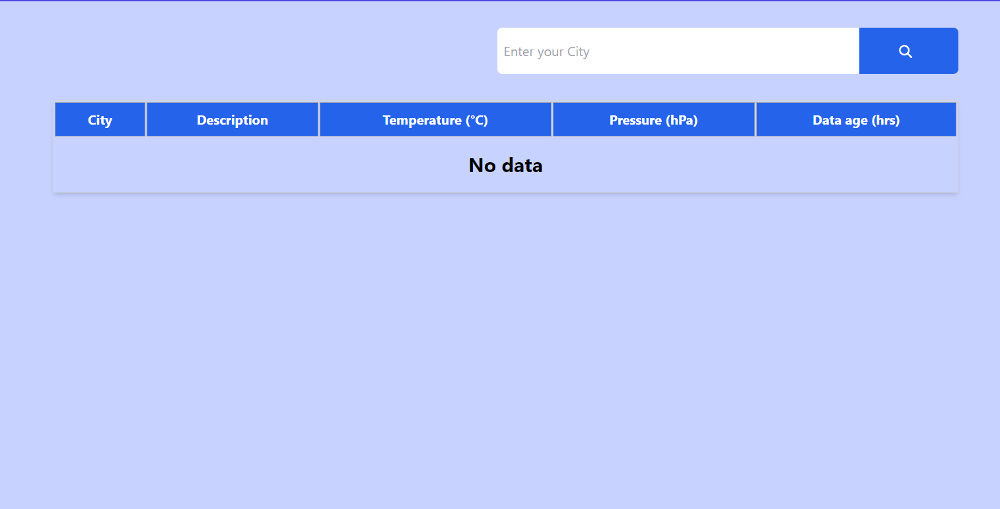

# Weather Dashboard React Application

## Project Overview

This Weather Dashboard is a comprehensive React-based web application designed to provide real-time weather information across multiple cities. The project was developed as a practical exercise in React state management, API integration, and responsive web design.

## Project Screenshots  

### Main Dashboard Interface


### City Selection and Weather Display


## Key Functionalities

1. **Dynamic City Weather Retrieval**
   - Automatic weather data fetching for predefined cities
   - Custom city search functionality
   - Limit of 4 simultaneous active city weather displays

2. **Interactive Weather Management**
   - Editable weather descriptions
   - Real-time temperature and pressure display
   - Data age tracking
   - Individual city entry deletion

3. **Unique Features**
   - Prevents duplicate city entries
   - Highlights existing city entries
   - Responsive table design
   - City selection tracking

## Technical Implementation Details

### State Management
- Utilized React `useState` and `useEffect` hooks
- Managed multiple state variables:
  - `weatherDisplay`: Stores active weather entries
  - `cities`: Tracks city selection status
  - `searchCity`: Manages search input
  - `highlightedCity`: Handles city highlight logic

### API Integration
- Axios used for HTTP requests
- External weather API endpoint: 
  `https://python3-dot-parul-arena-2.appspot.com/test`
- Dynamic city weather data retrieval

### Packages and Libraries Used
- **React**: Core framework
- **Axios**: HTTP client
- **Tailwind CSS**: Styling and responsive design
- **FontAwesome**: Icon implementation
- **@fortawesome/react-fontawesome**: Icon component integration

## Unique Coding Approaches

### Duplicate City Prevention
```javascript
const handleClick = (state, city = null) => {
  const normalizedCity = city ? city.trim().toLowerCase() : null;
  
  // Check for existing city
  const isCityExists = weatherDisplay.some(
    (weather) => weather.city.toLowerCase() === normalizedCity
  );

  if (isCityExists) {
    // Highlight existing entry
    setHighlightedCity(normalizedCity);
    return;
  }
  // Proceed with adding new city
}
```

### City Highlighting Mechanism
- Implemented temporary highlight using `useEffect`
- Automatically clears highlight after 3 seconds
- Provides visual feedback for duplicate entries

## Learning Outcomes

1. Advanced React state management
2. Implementing complex component interactions
3. API integration techniques
4. Responsive design with Tailwind CSS
5. Error handling and user experience considerations

## Challenges Overcome

- Preventing duplicate city entries
- Managing multiple state variables
- Implementing dynamic highlighting
- Handling asynchronous API calls

## Future Improvements

1. **Enhanced Error Handling**
   - Implement comprehensive API error management
   - Add user-friendly error messages

2. **Advanced Features**
   - Geolocation-based weather retrieval
   - More detailed weather information
   - Persistent storage of weather data

3. **Performance Optimization**
   - Implement caching mechanism
   - Reduce unnecessary re-renders
   - Optimize API call frequency

4. **User Experience**
   - Add loading spinners
   - Implement more sophisticated city search
   - Create detailed weather modal/popup

5. **Testing**
   - Add unit and integration tests
   - Implement comprehensive error scenario testing

## Technical Requirements

- React 17+
- Node.js 14+
- npm 6+

## Installation

```bash
# Clone the repository
git clone https://your-repo-url.git

# Navigate to project directory
cd weather-dashboard

# Install dependencies
npm install

# Start development server
npm start
```

## Deployment

Recommended platforms:
- Vercel
- Netlify
- GitHub Pages

## Contact & Collaboration
Aditya Mishra
adityadevansh2002@gmail.com